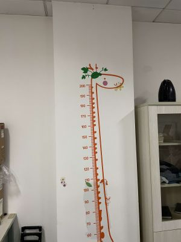
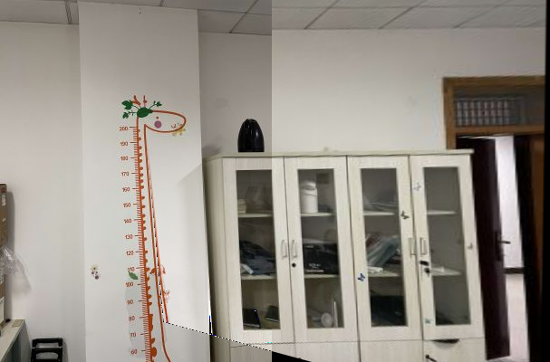

# EzImageStitch
Self-developed Image Stitching Tool

## run
```
python CONCAT.py
```

## result
 
<table>
    <tr>
        <td align='center'>左侧图</td> 
        <td align='center'>右侧图</td> 
   </tr>
   <tr>
   </tr>
        <td align='center'></td> 
        <td align='center'></td>
    <tr>
        <td colspan="2" align='center'>合成图</td>    
    </tr>
    <tr>
       <td  colspan="2"></td>  
    </tr>
</table>

